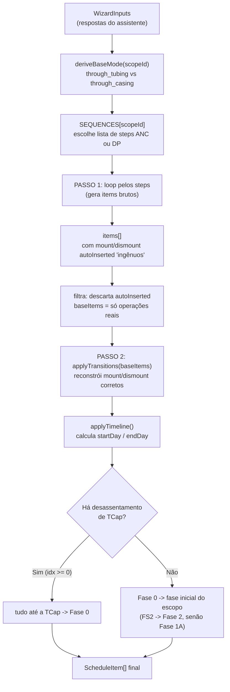
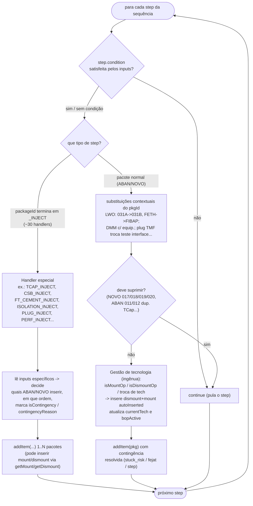
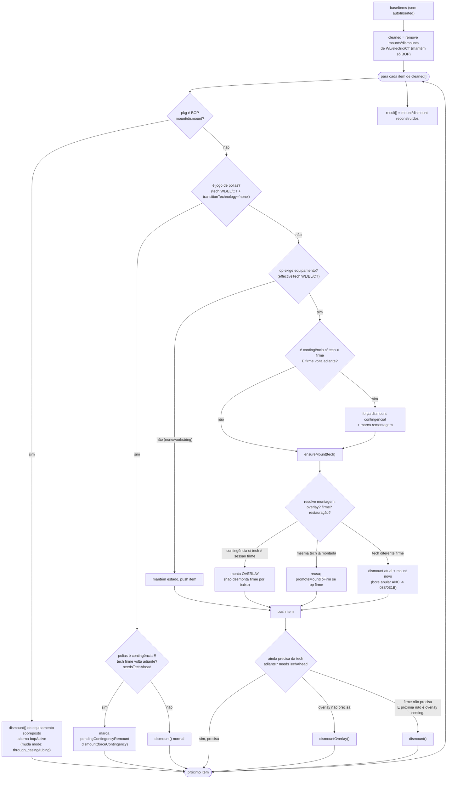

# Fluxo da engine — `sequenceEngine.ts`

Mapa de leitura dos diagramas abaixo, com referências de linha em
`abandono-app/src/engines/sequenceEngine.ts`.

A engine é um **pipeline de 2 passadas** dentro de `generateSchedule(inputs)` (linha 74):

1. **Passo 1 — Loop por step:** percorre a sequência base do escopo e insere os pacotes
   reais (e montagens/desmontagens "ingênuas" marcadas `autoInserted`).
2. **Passo 2 — `applyTransitions`:** descarta as montagens/desmontagens `autoInserted` e
   reconstrói toda a camada de mount/dismount de equipamento de pressão com as regras corretas.
3. **Finalização:** `applyTimeline` calcula `startDay`/`endDay` e há a reclassificação de
   fase pela TCap (linhas 1367-1382).

---

## 1. Pipeline geral (`generateSchedule`)

---

## 2. Passo 1 — Loop por step

Estágios do loop (linha 91):

- **Condições** (93-101): filtros simples (`clean_flowlines`, `remove_anm`, `stuck_risk`...).
- **Handlers `*_INJECT`** (104-1274): a lógica de domínio. Ex.: `TCAP_INJECT` (219),
  `FT_CEMENT_INJECT` (491), `ISOLATION_INJECT` (815), `PLUG_INJECT` (962).
- **Pacote normal** (1276-1354): substituições contextuais, supressões anti-duplicata e
  gestão *ingênua* de tecnologia.

---

## 3. Passo 2 — `applyTransitions` (máquina de estados de mount/dismount)

Estado rastreado por `applyTransitions` (linha 1418):

- **sessão firme** vs **overlay** (contingência com tecnologia diferente monta por cima
  sem desmontar a firme);
- **jogo de polias** (`transitionTechnology: 'none'` -> equipamento desmontado);
- **remontagem contingencial** (`pendingContingencyRemountTech`);
- **bore anular vs produção** no ANC (033/031B);
- look-ahead via `needsTechAhead` (1592) para só desmontar quando a tecnologia não volta.
